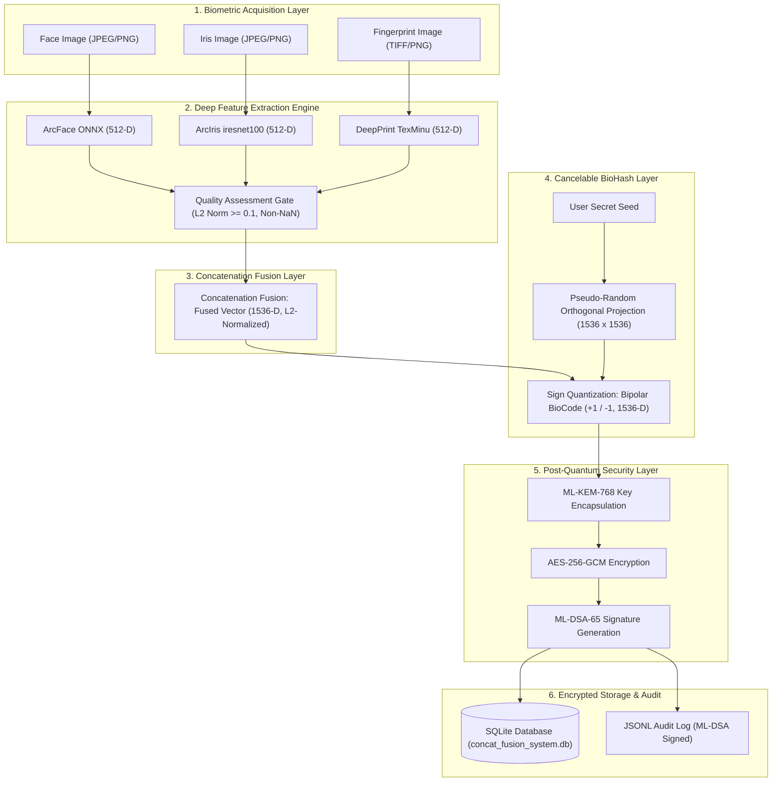

# Concatenation Fusion Biometric System

[](https://www.python.org/downloads/)
[](https://pytorch.org/)
[](https://csrc.nist.gov/projects/post-quantum-cryptography)
[](LICENSE)

An end-to-end, privacy-preserving, post-quantum secure **multimodal biometric system**. It fuses feature representations from **Face (ArcFace)**, **Iris (ArcIris)**, and **Fingerprint (DeepPrint)** into a **1536-D concatenated feature vector**, protected by **BioHash cancelable transformations** and NIST-standardized **Post-Quantum Cryptography (ML-KEM-768 & ML-DSA-65)**.

---

## 🌟 Key Features

- **Multimodal Deep Feature Extraction**:
  - **Face**: ArcFace (ResNet-50 backbone, 512-D, ONNX Runtime)
  - **Iris**: ArcIris (iresnet100 backbone + OpenIris normalization, 512-D, PyTorch)
  - **Fingerprint**: DeepPrint (TexMinu architecture, 512-D, PyTorch)
- **Feature-Level Concatenation Fusion**: Fuses modalities into a unified **1536-D L2-normalized** vector.
- **Cancelable BioHash Template Protection**: Converts fused vectors into **1536-D bipolar BioCodes** ($\pm 1/\sqrt{N}$) using user-seeded pseudo-random orthogonal projections.
- **Post-Quantum Security**:
  - **ML-KEM-768 (Kyber768)** for Key Encapsulation Mechanism.
  - **AES-256-GCM** for authenticated payload encryption.
  - **ML-DSA-65 (Dilithium3)** for digital signatures and audit trail non-repudiation.
- **Interactive Search Terminal**: 1:1 Verification & 1:N Gallery Identification CLI tool.
- **Real-Time Execution Engine**: On-the-fly feature extraction and database enrollment from raw image files without pre-cached embeddings.

---

## 📐 System Architecture Overview



---

## 🚀 Quickstart Guide

### 1. Clone Repository
```bash
git clone https://github.com/adityasen23453-droid/Concat-Fusion.git
cd Concat-Fusion
```

### 2. Install Dependencies
```bash
pip install -r src/open-iris/requirements/base.txt
pip install torch torchvision onnxruntime numpy pillow opencv-python
```

### 3. Place Raw Dataset Images
Place dataset folders under `data/Chimeric_Dataset_Noisy/`:
```text
data/Chimeric_Dataset_Noisy/
├── training/
│   ├── Person_001/
│   │   ├── face.jpg
│   │   ├── iris_right.jpg
│   │   └── fingerprint_right_thumb.jpg
│   └── Person_002/
└── testing/
    ├── Person_001/
    └── ...
```

---

## 💻 Terminal Commands & Usage

### A. Launch Interactive Terminal
```bash
python -X utf8 concat_fusion_search.py
```
> **Real-time Enrollment**: If `concat_fusion_system.db` is empty, the terminal automatically extracts features from `data/Chimeric_Dataset_Noisy/training/` and enrolls all subjects in real-time.

### B. Direct CLI 1:1 Verification
```bash
python -X utf8 concat_fusion_search.py --person_id 1 --claim_id Person_001
```

### C. Direct CLI 1:N Identification
```bash
python -X utf8 concat_fusion_search.py --person_id 5
```

### D. Automated System Demo
```bash
python -X utf8 concat_fusion_search.py --demo
```

### E. Population Benchmark Evaluation
```bash
python run_concat_fusion_population_eval.py
```

---

## 📚 Project Documentation

- 📖 [`system_working.md`](system_working.md): Comprehensive step-by-step project guide, execution flow, and mathematical proofs.
- 📐 [`architecture.md`](architecture.md): In-depth architectural specifications and component breakdown.
- 📂 [`files.md`](files.md): Repository file tree documentation and handoff guidelines.

---

## 🛡️ License

Distributed under the MIT License. See `LICENSE` for more information.
