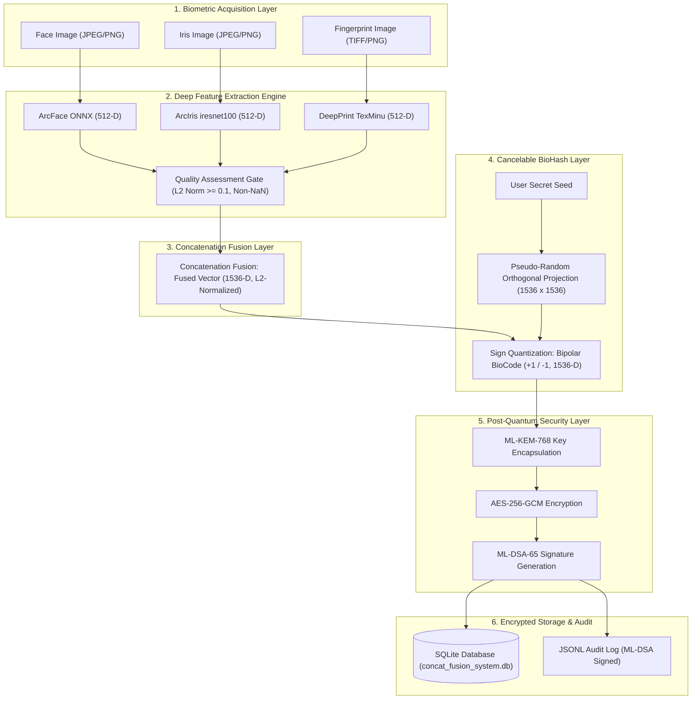
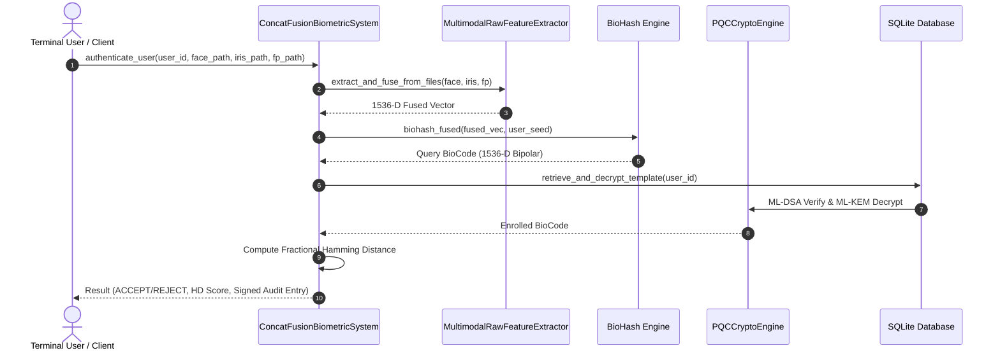

# System Architecture — Concatenation Fusion Biometric System

## 1. Executive Summary

The **Concatenation Fusion Biometric System** is a post-quantum secure, privacy-preserving multimodal biometric authentication framework. It fuses feature representations from three distinct biometric modalities:
1. **Face** (ArcFace / ResNet-50, 512-D)
2. **Iris** (ArcIris / iresnet100, 512-D)
3. **Fingerprint** (DeepPrint / TexMinu, 512-D)

The system transforms raw inputs into a unified **1536-D concatenated feature representation**, applies **BioHash cancelable transformation** for template protection and revocability, and secures stored templates using **NIST-standardized Post-Quantum Cryptography (PQC)**:
- **ML-KEM-768** (Kyber768) for Key Encapsulation Mechanism
- **AES-256-GCM** for Symmetric Payload Encryption
- **ML-DSA-65** (Dilithium3) for Digital Signatures and Non-Repudiable Audit Logging

---

## 2. High-Level Architecture Diagram

---

## 3. Subsystem Breakdown & Technical Specifications

### Layer 1: Biometric Acquisition & Feature Extraction

- **Face Feature Extractor (`ArcFace`)**:
  - Model Architecture: ResNet-50 backbone trained with Additive Angular Margin Loss (`w600k_r50.onnx`).
  - Input: $112 \times 112$ aligned RGB face patch.
  - Output: 512-dimensional vector.
  - Fallback: ResNet-18 ImageNet feature extractor if ONNX runtime model is unavailable.

- **Iris Feature Extractor (`ArcIris`)**:
  - Model Architecture: Modified `iresnet100` coupled with OpenIris normalization pipeline (`ResNet100_154000.pt`).
  - Input: Normalised polar iris image ($512 \times 64$, 8-bit grayscale).
  - Output: 512-dimensional vector.

- **Fingerprint Feature Extractor (`DeepPrint`)**:
  - Model Architecture: `DeepPrint TexMinu` combining texture and minutiae maps (`flx.models.deep_print_arch`).
  - Input: Binarized $256 \times 256$ fingerprint patch.
  - Output: 512-dimensional vector (concatenated 256-D texture + 256-D minutiae).

- **Quality Assessment Gate**:
  - Evaluates each extracted vector prior to fusion:
    1. Vector dimension must equal exactly 512.
    2. Vector must contain zero `NaN` or `Inf` values.
    3. L2 norm $\|x\|_2 \ge 0.1$.

---

### Layer 2: Concatenation Feature Fusion Engine

Feature-level fusion concatenates the three L2-normalized 512-D vectors:

$$v_{\text{raw}} = \begin{bmatrix} v_{\text{face}} \\ v_{\text{iris}} \\ v_{\text{fingerprint}} \end{bmatrix} \in \mathbb{R}^{1536}$$

The concatenated vector is subsequently L2-normalized:

$$v_{\text{fused}} = \frac{v_{\text{raw}}}{\|v_{\text{raw}}\|_2} \in \mathbb{S}^{1535}$$

**Advantages of Feature-Level Concatenation**:
- Retains full spatial cross-modality feature relationships without early information loss.
- Eliminates score-level calibration discrepancies across different biometric matchers.

---

### Layer 3: Cancelable Biometric Protection (BioHash Layer)

To protect biometric privacy and ensure template revocability:
1. A user-specific secret seed $S_u$ seeds a Cryptographically Secure Pseudo-Random Number Generator (CSPRNG).
2. A random projection matrix $M \in \mathbb{R}^{1536 \times 1536}$ is generated and Gram-Schmidt orthogonalized.
3. The fused vector $v_{\text{fused}}$ is projected and sign-quantized:

$$b = \frac{1}{\sqrt{1536}} \cdot \text{sign}\left( M \cdot v_{\text{fused}} \right) \in \left\{ \pm \frac{1}{\sqrt{1536}} \right\}^{1536}$$

**Security Properties**:
- **Non-Invertibility**: One-way sign quantization prevents reconstruction of raw biometric templates.
- **Revocability**: If a template is compromised, issuing a new seed $S_u'$ generates an uncorrelated BioCode.
- **Unlinkability**: Cross-matching across databases using different seeds yields near-zero correlation.

---

### Layer 4: Post-Quantum Cryptography & Key Management

The BioHash output $b$ is encrypted using NIST PQC standards via `PQCCryptoEngine`:

1. **Key Encapsulation Mechanism (ML-KEM-768 / Kyber768)**:
   - Generates a ephemeral symmetric key $K_{\text{AES}}$ via post-quantum lattice-based cryptography.
2. **Payload Encryption (AES-256-GCM)**:
   - Encrypts serialized BioCode using $K_{\text{AES}}$ with 96-bit random nonce and 128-bit authentication tag.
3. **Digital Signatures (ML-DSA-65 / Dilithium3)**:
   - Signs the encrypted ciphertext payload to guarantee anti-tampering and origin authenticity.

---

### Layer 5: Encrypted Storage & Audit Infrastructure

- **SQLite Enrollment Database (`concat_fusion_system.db`)**:
  - Table: `concat_fused_templates`
  - Columns: `user_id`, `template_id`, `modality`, `kem_ciphertext`, `nonce`, `ciphertext`, `signature`, `quality_score`, `created_at`.
- **Signed Audit Trail (`auth_audit_log.jsonl`)**:
  - Records every enrollment and authentication attempt.
  - Each JSON entry is appended with an `audit_signature` generated using ML-DSA-65.

---

### Layer 6: Matching & Decision Logic

Matching is performed directly between binary sign patterns using **Fractional Hamming Distance**:

$$HD(b_{\text{query}}, b_{\text{enrolled}}) = \frac{1}{1536} \sum_{i=1}^{1536} \mathbb{I}\left[ \text{sign}(b_{\text{query}, i}) \neq \text{sign}(b_{\text{enrolled}, i}) \right]$$

- **Acceptance Threshold**: $T_{\text{HD}} = 0.30$
- **Decision Criteria**:
  - $\text{ACCEPT}$ if $HD < 0.30$ (Identical subjects yield $HD \approx 0.15 - 0.25$).
  - $\text{REJECT}$ if $HD \ge 0.30$ (Impostor pairs yield $HD \approx 0.45 - 0.50$).

---

## 4. Pipeline Execution Summary

