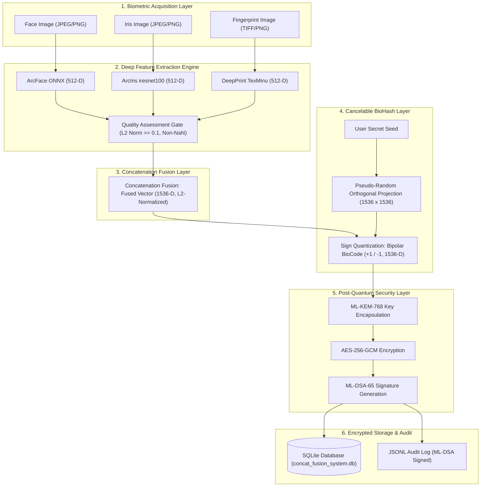
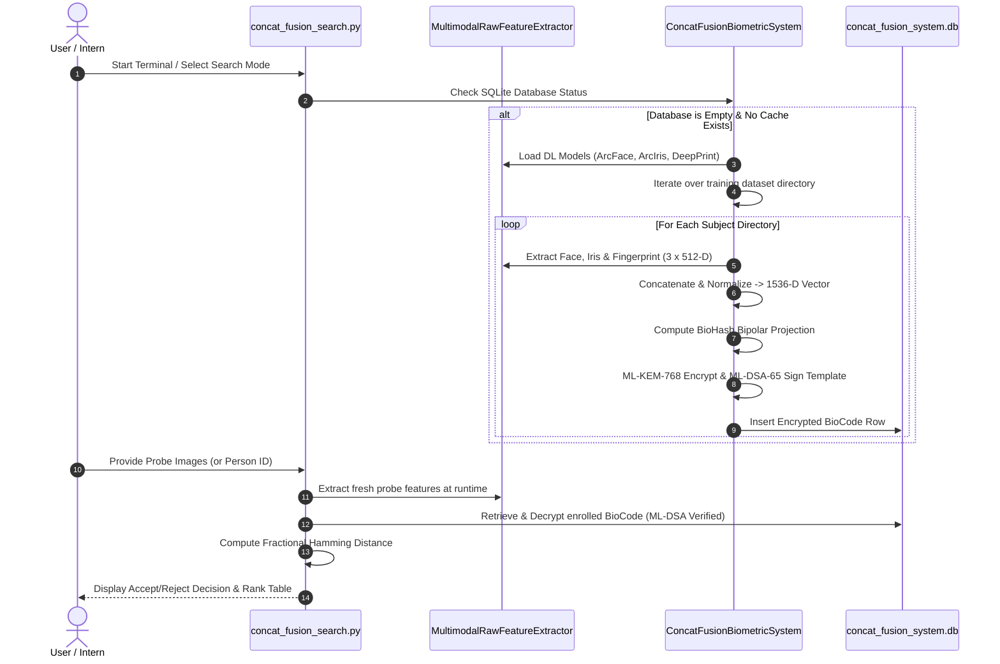

# Comprehensive System Working & Project Guide — Concatenation Fusion Biometric System

## 1. Project Overview & Core Philosophy

The **Concatenation Fusion Biometric System** is an end-to-end, privacy-preserving, post-quantum secure multimodal biometric authentication framework. 

Traditional single-modality biometrics (such as face-only or fingerprint-only systems) suffer from noise sensitivity, spoof attacks, and quality degradation. This system addresses those vulnerabilities by fusing feature representations from three complementary biometric modalities:
1. **Face** (ArcFace ONNX / ResNet-50 backbone, 512-D)
2. **Iris** (ArcIris / iresnet100 backbone + OpenIris normalization, 512-D)
3. **Fingerprint** (DeepPrint / TexMinu architecture, 512-D)

---

## 2. Complete Architecture & Mathematical Foundations



### Mathematical Breakdown

#### A. Feature-Level Concatenation Fusion
Given three 512-dimensional L2-normalized vectors $v_{\text{face}}, v_{\text{iris}}, v_{\text{fp}} \in \mathbb{R}^{512}$, the concatenated vector $v_{\text{raw}}$ is formed by stacking them:

$$v_{\text{raw}} = \begin{bmatrix} v_{\text{face}} \\ v_{\text{iris}} \\ v_{\text{fp}} \end{bmatrix} \in \mathbb{R}^{1536}$$

The fused representation is then L2-normalized:

$$v_{\text{fused}} = \frac{v_{\text{raw}}}{\|v_{\text{raw}}\|_2} \in \mathbb{S}^{1535}$$

#### B. BioHash Cancelable Transformation
A user-specific secret token $S_u$ seeds a Cryptographically Secure Pseudo-Random Number Generator (CSPRNG) to construct an orthogonal matrix $M \in \mathbb{R}^{1536 \times 1536}$. The protected template (BioCode) is calculated via sign-quantization:

$$b = \frac{1}{\sqrt{1536}} \cdot \text{sign}(M \cdot v_{\text{fused}}) \in \left\{ \pm \frac{1}{\sqrt{1536}} \right\}^{1536}$$

#### C. Post-Quantum Envelope Encryption
- **ML-KEM-768 (Kyber768)** encapsulates a 256-bit symmetric key $K$.
- **AES-256-GCM** encrypts $b$ using $K$ with a 96-bit random nonce.
- **ML-DSA-65 (Dilithium3)** signs the encrypted payload to prevent database tampering.

#### D. Fractional Hamming Distance Matching
Given a query BioCode $b_q$ and an enrolled BioCode $b_e$:

$$HD(b_q, b_e) = \frac{1}{1536} \sum_{i=1}^{1536} \mathbb{I} \left[ \text{sign}(b_{q, i}) \neq \text{sign}(b_{e, i}) \right]$$

- **Decision Criteria**:
  - $\text{ACCEPT}$ if $HD < 0.30$
  - $\text{REJECT}$ if $HD \ge 0.30$

---

## 3. Installation & Setup Guide

### Step 1: Clone Repository
```bash
git clone https://github.com/adityasen23453-droid/Concat-Fusion.git
cd Concat-Fusion
```

### Step 2: Install Python Dependencies
Ensure Python 3.9+ is installed, then run:
```bash
pip install -r src/open-iris/requirements/base.txt
pip install torch torchvision onnxruntime numpy pillow opencv-python
```

---

## 4. Dataset Directory Layout

Place your raw biometric dataset under `data/Chimeric_Dataset_Noisy/`:

```text
data/
└── Chimeric_Dataset_Noisy/
    ├── training/
    │   ├── Person_001/
    │   │   ├── face.jpg
    │   │   ├── iris_right.jpg
    │   │   └── fingerprint_right_thumb.jpg
    │   ├── Person_002/
    │   └── ...
    └── testing/
        ├── Person_001/
        │   ├── face_test.jpg
        │   ├── iris_test.jpg
        │   └── fingerprint_test.tif
        └── ...
```

---

## 5. Step-by-Step Terminal Commands & Usage Modes

### Mode 1: Interactive Terminal Menu
Launch the interactive terminal search interface:
```bash
python -X utf8 concat_fusion_search.py
```
If the SQLite database (`concat_fusion_system.db`) does not exist, the system will **automatically run real-time enrollment** on all subjects in `data/Chimeric_Dataset_Noisy/training/`.

---

### Mode 2: 1:1 Verification (CLI Direct)
Matches a query probe against a claimed identity:
```bash
python -X utf8 concat_fusion_search.py --person_id 1 --claim_id Person_001
```

---

### Mode 3: 1:N Gallery Identification (CLI Direct)
Searches an unknown probe across all enrolled subjects in the gallery:
```bash
python -X utf8 concat_fusion_search.py --person_id 3
```

---

### Mode 4: Automated Verification Demo
Runs automated verification tests:
```bash
python -X utf8 concat_fusion_search.py --demo
```

---

### Mode 5: Population-Wide Benchmark Evaluation
Computes population-wide metrics (EER, FAR, FRR, ROC, DET curves):
```bash
python run_concat_fusion_population_eval.py
```

Generated charts are saved to `Concatenation Fusion Reports/`:
- `post_1_score_distribution.png`: Score distributions (Genuine vs Impostor)
- `post_2_far_frr_sweep.png`: Threshold sweep curve
- `post_3_det_curve.png`: Detection Error Trade-off (DET) curve
- `post_4_roc_curve.png`: ROC curve
- `post_5_confusion_matrix.png`: Verification confusion matrix

---

## 6. Real-Time Execution Sequence Diagram



---

## 7. Security Features & Anti-Tampering

1. **Envelope Encryption**: Enrolled templates are protected using **ML-KEM-768** and **AES-256-GCM**.
2. **Database Anti-Tampering**: Every row is signed with an **ML-DSA-65** digital signature. Tampered database records are rejected automatically.
3. **Audit Log Non-Repudiation**: Authentication logs are saved in `data/databases_and_cache/auth_audit_log.jsonl` with ML-DSA signatures.

---

## 8. Troubleshooting & FAQ

- **Q: Does it work without a GPU?**
  - Yes! The extractor detects CUDA automatically. If GPU is unavailable, it runs seamlessly on CPU.
- **Q: How to re-enroll the database from scratch?**
  - Delete `data/databases_and_cache/concat_fusion_system.db`. Re-running `concat_fusion_search.py` will rebuild the database automatically.
