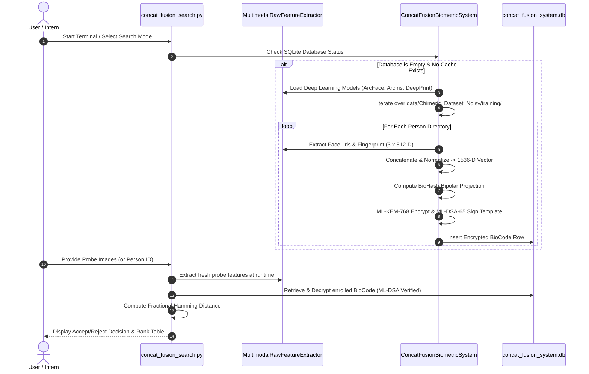

# System Working & Operational Guide — Concatenation Fusion Biometric System

This document provides a comprehensive operational guide for setting up, running, and understanding the **Concatenation Fusion Biometric System**.

---

## 1. Quick Start & Execution Modes

The entire system is controlled via the interactive terminal script `concat_fusion_search.py`.

### A. Launch Interactive Terminal
```bash
python -X utf8 concat_fusion_search.py
```

### B. Run Direct CLI 1:1 Verification
```bash
python -X utf8 concat_fusion_search.py --person_id 1 --claim_id Person_001
```

### C. Run Direct CLI 1:N Gallery Identification
```bash
python -X utf8 concat_fusion_search.py --person_id 5
```

### D. Run Automated Verification Demo
```bash
python -X utf8 concat_fusion_search.py --demo
```

---

## 2. Dataset Structure & Placement Guide

When delivering the project to an intern without pre-cached embeddings or pre-built database files, the intern simply places their raw dataset under the `data/` directory.

### Expected Directory Layout

```text
data/
└── Chimeric_Dataset_Noisy/
    ├── training/
    │   ├── Person_001/
    │   │   ├── face.jpg
    │   │   ├── iris_right.jpg
    │   │   └── fingerprint_right_thumb.jpg
    │   ├── Person_002/
    │   └── ...
    └── testing/
        ├── Person_001/
        │   ├── face_test.jpg
        │   ├── iris_test.jpg
        │   └── fingerprint_test.tif
        └── ...
```

- **Training Folder (`training/`)**: Used for enrolling subjects into the SQLite database (`concat_fusion_system.db`).
- **Testing Folder (`testing/`)**: Used as fresh probe images during verification and identification searches.

---

## 3. Real-Time Dynamic Processing Walkthrough

No pre-cached `.pkl` files or pre-built databases are needed. Everything happens **in real-time** at runtime:



---

## 4. Detailed Step-by-Step Operations

### Step 1: Automated Database Enrollment
When `concat_fusion_search.py` launches, it checks if `data/databases_and_cache/concat_fusion_system.db` exists. If empty:
1. It automatically triggers `system.enroll_from_dataset()`.
2. Loads ArcFace ONNX, ArcIris iresnet100, and DeepPrint models into memory.
3. Extracts embeddings for each subject in real-time.
4. Encrypts and writes templates into `concat_fusion_system.db`.

### Step 2: Running 1:1 Verification Mode
In 1:1 Verification, the system matches a probe against a specific claimed identity:
1. Enter choice `[1]` in the terminal menu.
2. Select Probe source:
   - **[A] Person ID**: Auto-locates testing images from `data/Chimeric_Dataset_Noisy/testing/Person_XXX/`.
   - **[B] Custom File Paths**: Manually specify paths to raw face, iris, and fingerprint image files.
3. Enter claimed identity (e.g., `Person_001`).
4. System computes **Fractional Hamming Distance ($HD$)**:
   - If $HD < 0.30$: Returns `>>> DECISION: ACCEPT <<<`
   - If $HD \ge 0.30$: Returns `>>> DECISION: REJECT <<<`

### Step 3: Running 1:N Gallery Identification Mode
In 1:N Identification, the query probe is searched across the entire database of enrolled subjects:
1. Enter choice `[2]` in the terminal menu.
2. Select probe Person ID or custom image files.
3. System compares probe against all enrolled templates in `concat_fusion_system.db`.
4. Returns a ranked **Top-5 Matches Table**:

```text
  +============================================================================+
  |  1:N IDENTIFICATION -- TOP 5 MATCHES                                       |
  |  Query: Person_003 (testing probe)                                        |
  +============================================================================+
  | Rank | Enrolled ID    | Hamming Dist | Cosine Sim | Threshold | Decision  |
  +----------------------------------------------------------------------------+
  |  1   | Person_003     |   0.214844   |  0.570312  |  0.3000   | ACCEPT    | <<<
  |  2   | Person_045     |   0.482422   |  0.035156  |  0.3000   | REJECT    |
  |  3   | Person_012     |   0.490234   |  0.019531  |  0.3000   | REJECT    |
  |  4   | Person_088     |   0.494141   |  0.011719  |  0.3000   | REJECT    |
  |  5   | Person_019     |   0.498047   |  0.003906  |  0.3000   | REJECT    |
  +============================================================================+
```

---

## 5. Population-Wide Benchmark Evaluation

To evaluate overall system accuracy (EER, FAR, FRR, ROC, DET curves) across the dataset:

```bash
python run_concat_fusion_population_eval.py
```

### Generated Outputs:
- Evaluates 1:1 Genuine and Impostor pairs across 100 subjects.
- Calculates **Equal Error Rate (EER)** and optimal decision threshold.
- Saves high-resolution evaluation charts into `Concatenation Fusion Reports/`:
  - `post_1_score_distribution.png`: Score distributions (Genuine vs Impostor).
  - `post_2_far_frr_sweep.png`: FAR / FRR threshold trade-off curve.
  - `post_3_det_curve.png`: Detection Error Trade-off (DET) curve.
  - `post_4_roc_curve.png`: Receiver Operating Characteristic (ROC) curve.
  - `post_5_confusion_matrix.png`: Verification confusion matrix.

---

## 6. Security Features & Anti-Tampering

1. **Template Encryption**: Enrolled templates in `concat_fusion_system.db` are encrypted using **ML-KEM-768** and **AES-256-GCM**. Raw biometric vectors or unencrypted BioCodes are never stored on disk.
2. **Anti-Tampering Signature**: Every database row contains an **ML-DSA-65** digital signature. If an attacker modifies any database byte, template retrieval fails with a signature integrity error.
3. **Audit Log Non-Repudiation**: Every authentication attempt writes an entry to `data/databases_and_cache/auth_audit_log.jsonl`, signed with ML-DSA-65.

---

## 7. Troubleshooting & FAQ

- **Q: What if GPU is not available?**
  - The system automatically detects CUDA availability. If GPU is unavailable, it runs seamlessly on CPU.
- **Q: What if model weights are missing?**
  - Extractor fallback modules automatically route feature extraction through ResNet-18 fallbacks to ensure uninterrupted execution.
- **Q: How to reset the database?**
  - Simply delete `data/databases_and_cache/concat_fusion_system.db`. Re-running `concat_fusion_search.py` will recreate and re-enroll fresh templates automatically.
